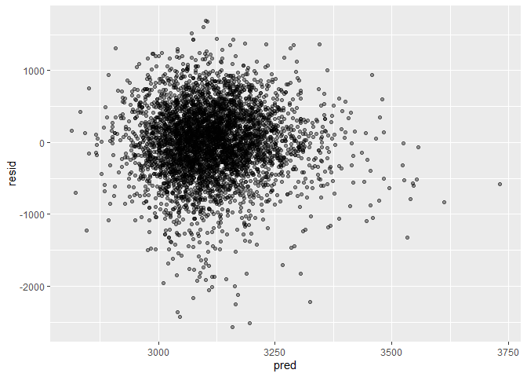
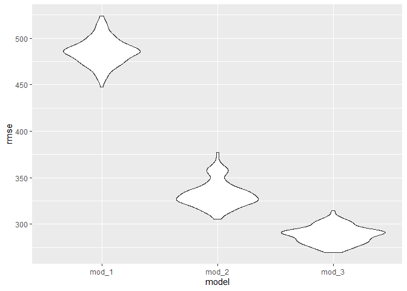
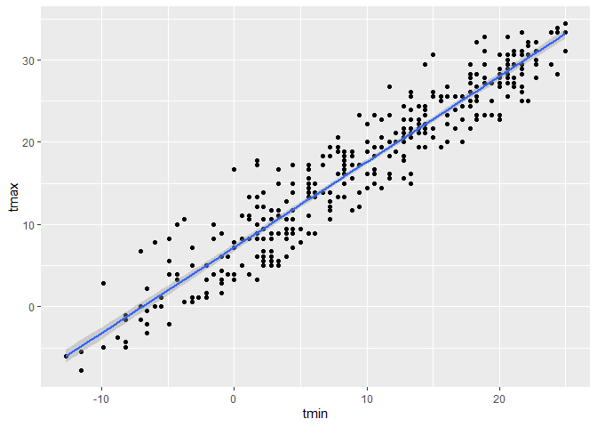
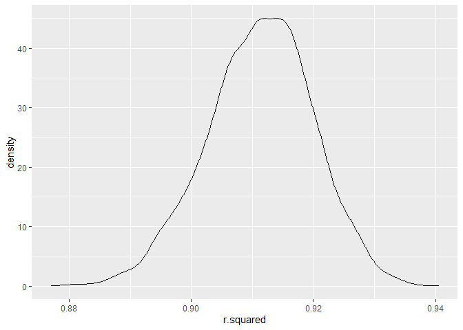
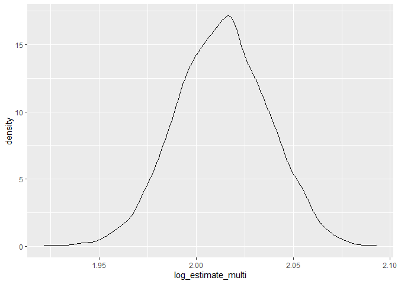

Homework 6
================
Ying Jin
2020/11/28

## Problem 1

Import the dataset

``` r
url_file = "https://raw.githubusercontent.com/washingtonpost/data-homicides/master/homicide-data.csv"

homicide_data = read_csv(url(url_file), na = c("", "NA", "Unknown"))
```

    ## Parsed with column specification:
    ## cols(
    ##   uid = col_character(),
    ##   reported_date = col_double(),
    ##   victim_last = col_character(),
    ##   victim_first = col_character(),
    ##   victim_race = col_character(),
    ##   victim_age = col_double(),
    ##   victim_sex = col_character(),
    ##   city = col_character(),
    ##   state = col_character(),
    ##   lat = col_double(),
    ##   lon = col_double(),
    ##   disposition = col_character()
    ## )

``` r
homicide_df =
  homicide_data %>% 
  mutate(
    city_state = str_c(city,state, sep = ", "),
    resolution = case_when(
      disposition == "Closed without arrest" ~ 0,
      disposition == "Open/No arrest" ~ 0,
      disposition == "Closed by arrest" ~ 1,
    ) ,
    victim_age = as.numeric(victim_age)
  ) %>% 
  filter(!(city_state %in% c("Dallas, TX", "Phoenix, AZ", "Kansas City, MO", "Tulsa, AL")),
         victim_race %in% c("Black","White")) %>% 
  select(city_state, resolution, victim_age, victim_race, victim_sex)
```

Start with one city

``` r
baltimore_df = 
  homicide_df %>% 
  filter(city_state == "Baltimore, MD")

glm(resolution ~ victim_age + victim_sex + victim_race, 
    data = baltimore_df, 
    family = binomial()) %>% 
  broom::tidy() %>% 
  mutate(
    OR = exp(estimate),
    CI_lower = exp(estimate - 1.96*std.error),
    CI_upper = exp(estimate + 1.96*std.error)
  ) %>% 
  select(term, OR, starts_with("CI_")) %>% 
  knitr::kable()
```

| term              |        OR | CI\_lower | CI\_upper |
| :---------------- | --------: | --------: | --------: |
| (Intercept)       | 1.3633992 | 0.9745721 | 1.9073576 |
| victim\_age       | 0.9932953 | 0.9868459 | 0.9997869 |
| victim\_sexMale   | 0.4255117 | 0.3245590 | 0.5578655 |
| victim\_raceWhite | 2.3204389 | 1.6475885 | 3.2680713 |

Try this across cities

``` r
models_results_df =
homicide_df %>% 
  nest(-city_state) %>% 
  mutate(
    models = map(.x = data, ~glm(resolution ~ victim_age + victim_sex + victim_race, 
    data = .x, 
    family = binomial())),
    results = map(models, broom::tidy)
  ) %>% 
  select(-data, -models) %>% 
  unnest(results) %>% 
  mutate(
     OR = exp(estimate),
    CI_lower = exp(estimate - 1.96*std.error),
    CI_upper = exp(estimate + 1.96*std.error)
  ) %>% 
  select(city_state, term, OR, starts_with("CI_"))
```

    ## Warning: All elements of `...` must be named.
    ## Did you want `data = c(resolution, victim_age, victim_race, victim_sex)`?

Make a plot

``` r
models_results_df %>% 
  filter(term == "victim_sexMale") %>% 
  mutate(
    city_state = fct_reorder(city_state, OR)
  ) %>% 
  ggplot(aes(x = city_state, y = OR)) +
  geom_point() +
  geom_errorbar(aes(ymin = CI_lower, ymax = CI_upper)) +
  theme(axis.text.x = element_text(angle = 70, hjust = 1))
```

<!-- -->

## Problem 2

import dataset

``` r
bwt_data = read_csv("./data/birthweight.csv")
```

    ## Parsed with column specification:
    ## cols(
    ##   .default = col_double()
    ## )

    ## See spec(...) for full column specifications.

tidy dataset

``` r
bwt_df = 
bwt_data %>% 
  mutate(
    babysex = factor(case_when(
      babysex == 1 ~"male",
      babysex == 2 ~"female")),
    frace = factor(case_when(
      frace == 1 ~"White",
      frace == 2 ~"Black",
      frace == 3 ~"Asian",
      frace == 4 ~"Puerto Rican",
      frace == 8 ~"Other",
      frace == 9 ~"Unknown"
    )),
    malform = factor(case_when(
      malform == 0 ~"absent",
      malform == 1 ~"present"
    )),
    mrace = factor(case_when(
      mrace == 1 ~"White",
      mrace == 2 ~"Black",
      mrace == 3 ~"Asian",
      mrace == 4 ~"Puerto Rican",
      mrace == 8 ~"Other"
    ))
  ) %>% 
  mutate(
    frace = fct_relevel(frace,"White", "Black", "Asian", "Puerto Rican", "Other"),
    mrace = fct_relevel(mrace,"White", "Black", "Asian", "Puerto Rican"),
    babysex = fct_relevel(babysex, "male")
  )
```

inspect NAs

``` r
bwt_df %>% 
  sapply(., function(x) sum(is.na(x)))
```

    ##  babysex    bhead  blength      bwt    delwt  fincome    frace  gaweeks 
    ##        0        0        0        0        0        0        0        0 
    ##  malform menarche  mheight   momage    mrace   parity  pnumlbw  pnumsga 
    ##        0        0        0        0        0        0        0        0 
    ##    ppbmi     ppwt   smoken   wtgain 
    ##        0        0        0        0

There is no NAs in this dataset

Then I try to build a linear model based on the dataset. I concentrate
on mom’s influence on their babies, so I mainly focus on predictors
related to mothers.

A [study](https://www.ncbi.nlm.nih.gov/pmc/articles/PMC2974327/) shows
there is consistent relationship between pregnancy weight gain and baby
birth weight. Another
[study](https://academic.oup.com/humrep/article/35/1/212/5713535) shows
size at birth is strongly related to length of gestation. In addition,
[a paper](https://www.nature.com/articles/pr2002265) reveals that
maternal parity had a large influence on size at birth

Based on findings above, I build a model which examines the association
between baby birth weight and mother’s weight gain during pregnancy,
gestational age in weeks, as well as number of live births prior to this
pregnancy.

``` r
mod = lm(bwt ~ wtgain + gaweeks + parity, data = bwt_df)

broom::tidy(mod) %>% 
  select(term, estimate, p.value) %>% 
  knitr::kable(digits = 3)
```

| term        | estimate | p.value |
| :---------- | -------: | ------: |
| (Intercept) |  449.302 |   0.000 |
| wtgain      |    8.886 |   0.000 |
| gaweeks     |   62.614 |   0.000 |
| parity      |  100.740 |   0.136 |

``` r
bwt_df %>% 
  select(bwt, wtgain, gaweeks, parity) %>% 
  add_residuals(model = mod) %>% 
  add_predictions(model = mod) %>% 
  ggplot(aes(x = pred, y = resid)) +
  geom_point(alpha = .4) +
  geom_smooth(method = "lm", se = F, color = "red")
```

    ## `geom_smooth()` using formula 'y ~ x'

<!-- -->

Another two models:

  - One using length at birth and gestational age as predictors (main
    effects only)

  - Another using head circumference, length, sex, and all interactions
    (including the three-way interaction) between these

<!-- end list -->

``` r
mod_1 = lm(bwt ~ blength + gaweeks, data = bwt_df)

broom::tidy(mod_1) %>% 
  select(term, estimate, p.value) %>% 
  knitr::kable(digits = 3)
```

| term        |   estimate | p.value |
| :---------- | ---------: | ------: |
| (Intercept) | \-4347.667 |       0 |
| blength     |    128.556 |       0 |
| gaweeks     |     27.047 |       0 |

``` r
mod_2 = lm(bwt ~ bhead*blength*babysex, data = bwt_df)

broom::tidy(mod_2) %>% 
  select(term, estimate, p.value) %>% 
  knitr::kable(digits = 3)
```

| term                        |   estimate | p.value |
| :-------------------------- | ---------: | ------: |
| (Intercept)                 | \-7176.817 |   0.000 |
| bhead                       |    181.796 |   0.000 |
| blength                     |    102.127 |   0.000 |
| babysexfemale               |   6374.868 |   0.000 |
| bhead:blength               |    \-0.554 |   0.478 |
| bhead:babysexfemale         |  \-198.393 |   0.000 |
| blength:babysexfemale       |  \-123.773 |   0.000 |
| bhead:blength:babysexfemale |      3.878 |   0.000 |

Then I conduct cross validation. Firstly, split the dataset into train
and test datasets.

``` r
cv_df = crossv_mc(bwt_df, 100)
```

Fit models and obtain RMSE

``` r
cv_df =
cv_df %>% 
  mutate(
    linear_mod_1 = map(.x = train, ~lm(bwt ~ wtgain + gaweeks + parity, data = .x)),
    linear_mod_2 = map(.x = train, ~lm(bwt ~ blength + gaweeks, data = .x)),
    linear_mod_3 = map(.x = train, ~lm(bwt ~  bhead*blength*babysex, data = .x))
  ) %>% 
  mutate(
    rmse_mod_1 = map2_dbl(.x = linear_mod_1, .y = test, ~rmse(model = .x, data = .y)),
    rmse_mod_2 = map2_dbl(.x = linear_mod_2, .y = test, ~rmse(model = .x, data = .y)),
    rmse_mod_3 = map2_dbl(.x = linear_mod_3, .y = test, ~rmse(model = .x, data = .y))
    ) 
```

    ## Warning: Problem with `mutate()` input `rmse_mod_1`.
    ## i prediction from a rank-deficient fit may be misleading
    ## i Input `rmse_mod_1` is `map2_dbl(.x = linear_mod_1, .y = test, ~rmse(model = .x, data = .y))`.

    ## Warning in predict.lm(model, data): prediction from a rank-deficient fit may be
    ## misleading

Make plots for comparison

``` r
cv_df %>% 
  select(starts_with("rmse_")) %>% 
  pivot_longer(
    everything(),
    names_to = "model",
    names_prefix = "rmse_",
    values_to = "rmse"
  ) %>% 
  mutate(model = fct_inorder(model)) %>% 
  ggplot(aes(x = model, y = rmse)) +
  geom_violin()
```

<!-- -->

Based on th plot, model 3 has the lowest **RMSE** and model 1 has the
highest **RMSE**.

## Problem 3

Import the dataset

``` r
weather_df = 
  rnoaa::meteo_pull_monitors(
    c("USW00094728"),
    var = c("PRCP", "TMIN", "TMAX"), 
    date_min = "2017-01-01",
    date_max = "2017-12-31") %>%
  mutate(
    name = recode(id, USW00094728 = "CentralPark_NY"),
    tmin = tmin / 10,
    tmax = tmax / 10) %>%
  select(name, id, everything())
```

    ## Registered S3 method overwritten by 'hoardr':
    ##   method           from
    ##   print.cache_info httr

    ## using cached file: C:\Users\jinyc\AppData\Local\cache/R/noaa_ghcnd/USW00094728.dly

    ## date created (size, mb): 2020-10-01 23:25:20 (7.534)

    ## file min/max dates: 1869-01-01 / 2020-09-30

Make plot of tmax vs. tmin

``` r
weather_df %>% 
  ggplot(aes(x = tmin, y = tmax)) +
  geom_point() +
  geom_smooth(method = "lm")
```

    ## `geom_smooth()` using formula 'y ~ x'

<!-- -->

According to this plot, the points represetning lower t\_min and t\_max
distributed more disperse around the fitted line.

use `bootstrap` function to conduct repeated sampling and do analysis

``` r
weather_boot_results =
weather_df %>% 
  modelr::bootstrap(n = 5000, id = "strap_number") %>% 
  mutate(
    models = map(.x = strap, ~lm(tmax ~ tmin, data = .x)),
    results_glance = map(models, broom::glance),
    results_tidy = map(models, broom::tidy)
  ) %>% 
  select(strap_number, results_glance, results_tidy) %>% 
  unnest(results_glance, results_tidy) %>% 
  select(strap_number, r.squared, term, estimate) %>% 
  pivot_wider(
    everything(),
    names_from = term,
    values_from = estimate
  ) %>% 
  mutate(
    log_estimate_multi = log(`(Intercept)`*tmin)
  ) %>% 
  select(-`(Intercept)`, -tmin)
```

    ## Warning: unnest() has a new interface. See ?unnest for details.
    ## Try `df %>% unnest(c(results_glance, results_tidy))`, with `mutate()` if needed

Make plot to see the distribution of r^2

``` r
weather_boot_results %>% 
  ggplot(aes(x = r.squared)) +
  geom_density()
```

<!-- -->

From the plot above we can see that the distribution of r^2 is a little
left-skewed. Combined with the plot of tmax vs. tmin, I think that’s
because some samples were drawn from points with lower t\_min and
t\_max. These points have higher variance regrading the fitted line
compared to other points. In this way, with bootstrap, the distribution
of r^2 was fairly displayed.

And make another plot to see the distribution of log(β\_0∗β\_1)

``` r
weather_boot_results %>% 
  ggplot(aes(x = log_estimate_multi)) +
  geom_density()
```

<!-- -->

Based on this plot, we can find that the distribution of log(β\_0∗β\_1)
is also a little left-skewed. And the reason for it is the same as that
for the distribution of r^2.

Next, construct 95% CI for r^2 and log(β\_0∗β\_1)

``` r
weather_boot_results %>% 
  pivot_longer(
    r.squared:log_estimate_multi,
    names_to = "term",
    values_to = "estimate"
  ) %>% 
  group_by(term) %>% 
  summarise(
    CI_lower = quantile(estimate, 0.025),
    CI_upper = quantile(estimate, 0.975)
  )
```

    ## `summarise()` ungrouping output (override with `.groups` argument)

    ## # A tibble: 2 x 3
    ##   term               CI_lower CI_upper
    ##   <chr>                 <dbl>    <dbl>
    ## 1 log_estimate_multi    1.97     2.06 
    ## 2 r.squared             0.894    0.927
