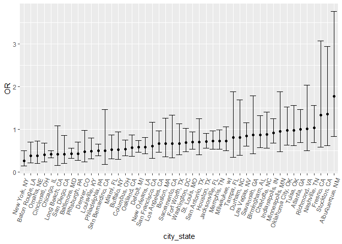

Homework 6
================
Ying Jin
2020/11/28

## Problem 1

Import the dataset

``` r
url_file = "https://raw.githubusercontent.com/washingtonpost/data-homicides/master/homicide-data.csv"

homicide_data = read_csv(url(url_file), na = c("", "NA", "Unknown"))
```

    ## Parsed with column specification:
    ## cols(
    ##   uid = col_character(),
    ##   reported_date = col_double(),
    ##   victim_last = col_character(),
    ##   victim_first = col_character(),
    ##   victim_race = col_character(),
    ##   victim_age = col_double(),
    ##   victim_sex = col_character(),
    ##   city = col_character(),
    ##   state = col_character(),
    ##   lat = col_double(),
    ##   lon = col_double(),
    ##   disposition = col_character()
    ## )

``` r
homicide_df =
  homicide_data %>% 
  mutate(
    city_state = str_c(city,state, sep = ", "),
    resolution = case_when(
      disposition == "Closed without arrest" ~ 0,
      disposition == "Open/No arrest" ~ 0,
      disposition == "Closed by arrest" ~ 1,
    ) ,
    victim_age = as.numeric(victim_age)
  ) %>% 
  filter(!(city_state %in% c("Dallas, TX", "Phoenix, AZ", "Kansas City, MO", "Tulsa, AL")),
         victim_race %in% c("Black","White")) %>% 
  select(city_state, resolution, victim_age, victim_race, victim_sex)
```

Start with one city

``` r
baltimore_df = 
  homicide_df %>% 
  filter(city_state == "Baltimore, MD")

glm(resolution ~ victim_age + victim_sex + victim_race, 
    data = baltimore_df, 
    family = binomial()) %>% 
  broom::tidy() %>% 
  mutate(
    OR = exp(estimate),
    CI_lower = exp(estimate - 1.96*std.error),
    CI_upper = exp(estimate + 1.96*std.error)
  ) %>% 
  select(term, OR, starts_with("CI_")) %>% 
  knitr::kable()
```

| term              |        OR | CI\_lower | CI\_upper |
| :---------------- | --------: | --------: | --------: |
| (Intercept)       | 1.3633992 | 0.9745721 | 1.9073576 |
| victim\_age       | 0.9932953 | 0.9868459 | 0.9997869 |
| victim\_sexMale   | 0.4255117 | 0.3245590 | 0.5578655 |
| victim\_raceWhite | 2.3204389 | 1.6475885 | 3.2680713 |

Try this across cities

``` r
models_results_df =
homicide_df %>% 
  nest(-city_state) %>% 
  mutate(
    models = map(.x = data, ~glm(resolution ~ victim_age + victim_sex + victim_race, 
    data = .x, 
    family = binomial())),
    results = map(models, broom::tidy)
  ) %>% 
  select(-data, -models) %>% 
  unnest(results) %>% 
  mutate(
     OR = exp(estimate),
    CI_lower = exp(estimate - 1.96*std.error),
    CI_upper = exp(estimate + 1.96*std.error)
  ) %>% 
  select(city_state, term, OR, starts_with("CI_"))
```

    ## Warning: All elements of `...` must be named.
    ## Did you want `data = c(resolution, victim_age, victim_race, victim_sex)`?

Make a plot

``` r
models_results_df %>% 
  filter(term == "victim_sexMale") %>% 
  mutate(
    city_state = fct_reorder(city_state, OR)
  ) %>% 
  ggplot(aes(x = city_state, y = OR)) +
  geom_point() +
  geom_errorbar(aes(ymin = CI_lower, ymax = CI_upper)) +
  theme(axis.text.x = element_text(angle = 70, hjust = 1))
```

<!-- -->
