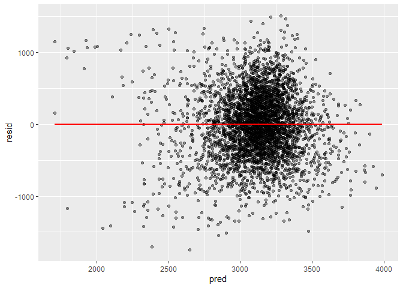
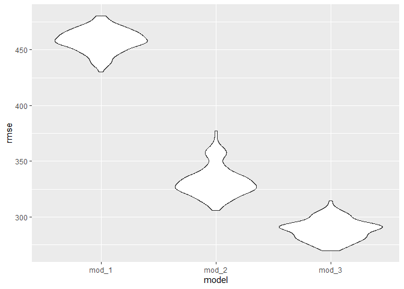
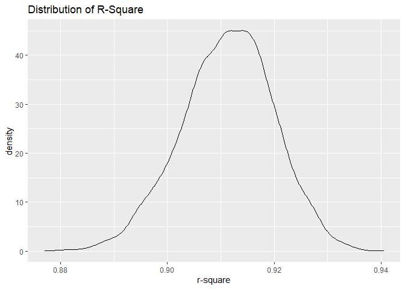
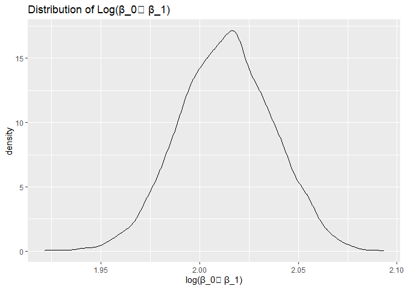

Homework 6
================
Ying Jin
2020/11/28

## Problem 1

Import the dataset

``` r
url_file = "https://raw.githubusercontent.com/washingtonpost/data-homicides/master/homicide-data.csv"

homicide_data = read_csv(url(url_file), na = c("", "NA", "Unknown"))
```

    ## Parsed with column specification:
    ## cols(
    ##   uid = col_character(),
    ##   reported_date = col_double(),
    ##   victim_last = col_character(),
    ##   victim_first = col_character(),
    ##   victim_race = col_character(),
    ##   victim_age = col_double(),
    ##   victim_sex = col_character(),
    ##   city = col_character(),
    ##   state = col_character(),
    ##   lat = col_double(),
    ##   lon = col_double(),
    ##   disposition = col_character()
    ## )

``` r
homicide_df =
  homicide_data %>% 
  mutate(
    city_state = str_c(city,state, sep = ", "),
    resolution = case_when(
      disposition == "Closed without arrest" ~ 0,
      disposition == "Open/No arrest" ~ 0,
      disposition == "Closed by arrest" ~ 1,
    ) ,
    victim_age = as.numeric(victim_age)
  ) %>% 
  filter(!(city_state %in% c("Dallas, TX", "Phoenix, AZ", "Kansas City, MO", "Tulsa, AL")),
         victim_race %in% c("Black","White")) %>% 
  select(city_state, resolution, victim_age, victim_race, victim_sex)
```

Start with one city

``` r
baltimore_df = 
  homicide_df %>% 
  filter(city_state == "Baltimore, MD")

glm(resolution ~ victim_age + victim_sex + victim_race, 
    data = baltimore_df, 
    family = binomial()) %>% 
  broom::tidy() %>% 
  mutate(
    OR = exp(estimate),
    CI_lower = exp(estimate - 1.96*std.error),
    CI_upper = exp(estimate + 1.96*std.error)
  ) %>% 
  select(term, OR, starts_with("CI_")) %>% 
  knitr::kable()
```

| term              |        OR | CI\_lower | CI\_upper |
| :---------------- | --------: | --------: | --------: |
| (Intercept)       | 1.3633992 | 0.9745721 | 1.9073576 |
| victim\_age       | 0.9932953 | 0.9868459 | 0.9997869 |
| victim\_sexMale   | 0.4255117 | 0.3245590 | 0.5578655 |
| victim\_raceWhite | 2.3204389 | 1.6475885 | 3.2680713 |

Try this across cities

``` r
models_results_df =
homicide_df %>% 
  nest(-city_state) %>% 
  mutate(
    models = map(.x = data, ~glm(resolution ~ victim_age + victim_sex + victim_race, 
    data = .x, 
    family = binomial())),
    results = map(models, broom::tidy)
  ) %>% 
  select(-data, -models) %>% 
  unnest(results) %>% 
  mutate(
     OR = exp(estimate),
    CI_lower = exp(estimate - 1.96*std.error),
    CI_upper = exp(estimate + 1.96*std.error)
  ) %>% 
  select(city_state, term, OR, starts_with("CI_"))
```

    ## Warning: All elements of `...` must be named.
    ## Did you want `data = c(resolution, victim_age, victim_race, victim_sex)`?

Make a plot

``` r
models_results_df %>% 
  filter(term == "victim_sexMale") %>% 
  mutate(
    city_state = fct_reorder(city_state, OR)
  ) %>% 
  ggplot(aes(x = city_state, y = OR)) +
  geom_point() +
  geom_errorbar(aes(ymin = CI_lower, ymax = CI_upper)) +
  theme(axis.text.x = element_text(angle = 70, hjust = 1))
```

<!-- -->

## Problem 2

import dataset

``` r
bwt_data = read_csv("./data/birthweight.csv")
```

    ## Parsed with column specification:
    ## cols(
    ##   .default = col_double()
    ## )

    ## See spec(...) for full column specifications.

tidy dataset

``` r
bwt_df = 
bwt_data %>% 
  mutate(
    babysex = as.factor(babysex),
    frace = as.factor(frace),
    malform = as.factor(malform),
    mrace = as.factor(mrace)
  )
```

inspect NAs

``` r
bwt_df %>% 
  sapply(., function(x) sum(is.na(x)))
```

    ##  babysex    bhead  blength      bwt    delwt  fincome    frace  gaweeks 
    ##        0        0        0        0        0        0        0        0 
    ##  malform menarche  mheight   momage    mrace   parity  pnumlbw  pnumsga 
    ##        0        0        0        0        0        0        0        0 
    ##    ppbmi     ppwt   smoken   wtgain 
    ##        0        0        0        0

There is no NAs in this dataset

Then I try to build a linear model based on the dataset, which examines
the association between baby birth weight and mother’s age, weight at
delivery and average number of cigarettes she smokes per day during
pregnancy.

``` r
mod = lm(bwt ~ momage + smoken + delwt, data = bwt_df)
broom::tidy(mod)
```

    ## # A tibble: 4 x 5
    ##   term        estimate std.error statistic   p.value
    ##   <chr>          <dbl>     <dbl>     <dbl>     <dbl>
    ## 1 (Intercept)  1863.      60.0       31.0  4.50e-191
    ## 2 momage         16.1      1.91       8.47 3.42e- 17
    ## 3 smoken         -6.82     0.996     -6.84 8.79e- 12
    ## 4 delwt           6.54     0.332     19.7  1.13e- 82

``` r
bwt_df %>% 
  select(bwt, momage, smoken, delwt) %>% 
  add_residuals(model = mod) %>% 
  add_predictions(model = mod) %>% 
  ggplot(aes(x = pred, y = resid)) +
  geom_point(alpha = .4)
```

<!-- -->

Another two models:

  - One using length at birth and gestational age as predictors (main
    effects only)

  - One using head circumference, length, sex, and all interactions
    (including the three-way interaction) between these

<!-- end list -->

``` r
mod_1 = lm(bwt ~ blength + gaweeks, data = bwt_df)
broom::tidy(mod_1)
```

    ## # A tibble: 3 x 5
    ##   term        estimate std.error statistic  p.value
    ##   <chr>          <dbl>     <dbl>     <dbl>    <dbl>
    ## 1 (Intercept)  -4348.      98.0      -44.4 0.      
    ## 2 blength        129.       1.99      64.6 0.      
    ## 3 gaweeks         27.0      1.72      15.7 2.36e-54

``` r
mod_2 = lm(bwt ~ bhead*blength*babysex, data = bwt_df)
broom::tidy(mod_2)
```

    ## # A tibble: 8 x 5
    ##   term                    estimate std.error statistic      p.value
    ##   <chr>                      <dbl>     <dbl>     <dbl>        <dbl>
    ## 1 (Intercept)            -7177.     1265.       -5.67  0.0000000149
    ## 2 bhead                    182.       38.1       4.78  0.00000184  
    ## 3 blength                  102.       26.2       3.90  0.0000992   
    ## 4 babysex2                6375.     1678.        3.80  0.000147    
    ## 5 bhead:blength             -0.554     0.780    -0.710 0.478       
    ## 6 bhead:babysex2          -198.       51.1      -3.88  0.000105    
    ## 7 blength:babysex2        -124.       35.1      -3.52  0.000429    
    ## 8 bhead:blength:babysex2     3.88      1.06      3.67  0.000245

Then I conduct cross validation. Firstly, split the dataset into train
and test datasets.

``` r
cv_df = crossv_mc(bwt_df, 100)
```

Fit models and obtain RMSE

``` r
cv_df =
cv_df %>% 
  mutate(
    linear_mod_1 = map(.x = train, ~lm(bwt ~ momage + smoken + delwt, data = .x)),
    linear_mod_2 = map(.x = train, ~lm(bwt ~ blength + gaweeks, data = .x)),
    linear_mod_3 = map(.x = train, ~lm(bwt ~  bhead*blength*babysex, data = .x))
  ) %>% 
  mutate(
    rmse_mod_1 = map2_dbl(.x = linear_mod_1, .y = test, ~rmse(model = .x, data = .y)),
    rmse_mod_2 = map2_dbl(.x = linear_mod_2, .y = test, ~rmse(model = .x, data = .y)),
    rmse_mod_3 = map2_dbl(.x = linear_mod_3, .y = test, ~rmse(model = .x, data = .y))
    ) 
```

Make plots for comparison

``` r
cv_df %>% 
  select(starts_with("rmse_")) %>% 
  pivot_longer(
    everything(),
    names_to = "model",
    names_prefix = "rmse_",
    values_to = "rmse"
  ) %>% 
  mutate(model = fct_inorder(model)) %>% 
  ggplot(aes(x = model, y = rmse)) +
  geom_violin()
```

<!-- -->

## Problem 3

Import the dataset

``` r
weather_df = 
  rnoaa::meteo_pull_monitors(
    c("USW00094728"),
    var = c("PRCP", "TMIN", "TMAX"), 
    date_min = "2017-01-01",
    date_max = "2017-12-31") %>%
  mutate(
    name = recode(id, USW00094728 = "CentralPark_NY"),
    tmin = tmin / 10,
    tmax = tmax / 10) %>%
  select(name, id, everything())
```

    ## Registered S3 method overwritten by 'hoardr':
    ##   method           from
    ##   print.cache_info httr

    ## using cached file: C:\Users\jinyc\AppData\Local\cache/R/noaa_ghcnd/USW00094728.dly

    ## date created (size, mb): 2020-10-01 23:25:20 (7.534)

    ## file min/max dates: 1869-01-01 / 2020-09-30

Make plot of tmax vs. tmin

``` r
weather_df %>% 
  ggplot(aes(x = tmin, y = tmax)) +
  geom_point() +
  geom_smooth(method = "lm")
```

    ## `geom_smooth()` using formula 'y ~ x'

<!-- -->

According to this plot, the points represetning lower t\_min and t\_max
distributed more disperse around the fitted line.

use `bootstrap` function to conduct repeated sampling and do analysis

``` r
weather_boot_results =
weather_df %>% 
  modelr::bootstrap(n = 5000, id = "strap_number") %>% 
  mutate(
    models = map(.x = strap, ~lm(tmax ~ tmin, data = .x)),
    results_glance = map(models, broom::glance),
    results_tidy = map(models, broom::tidy)
  ) %>% 
  select(strap_number, results_glance, results_tidy) %>% 
  unnest(results_glance, results_tidy) %>% 
  select(strap_number, r.squared, term, estimate) %>% 
  pivot_wider(
    everything(),
    names_from = term,
    values_from = estimate
  ) %>% 
  mutate(
    log_estimate_multi = log(`(Intercept)`*tmin)
  ) %>% 
  select(-`(Intercept)`, -tmin)
```

    ## Warning: unnest() has a new interface. See ?unnest for details.
    ## Try `df %>% unnest(c(results_glance, results_tidy))`, with `mutate()` if needed

Make plot to see the distribution of r^2

``` r
weather_boot_results %>% 
  ggplot(aes(x = r.squared)) +
  geom_density()
```

<!-- -->

From the plot above we can see that the distribution of r^2 is
left-skewed. Combined with the plot of tmax vs. tmin, I think that’s
because some samples were drawn from points with lower t\_min and
t\_max. These points have higher variance regrading the fitted line
compared to other points. In this way, with bootstrap, the distribution
of r^2 was fairly displayed.

And make another plot to see the distribution of log(β\_0∗β\_1)

``` r
weather_boot_results %>% 
  ggplot(aes(x = log_estimate_multi)) +
  geom_density()
```

<!-- -->

Based on this plot, we can find that the distribution of log(β\_0∗β\_1)
is also left-skewed. And the reason for it is the same as that for the
distribution of r^2.
